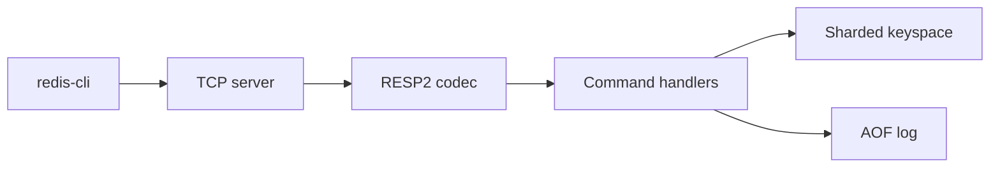

# Hafez

Hafez is a Redis-compatible in-memory key-value server written in Go. It speaks RESP2, so `redis-cli` and other Redis clients can talk to it. The server itself uses only the Go standard library.

Hafez (حافظ) means "the keeper" in Persian, and shares its root with the word for memory. It's also the name of a Persian poet whose words have stayed in people's memory for over 600 years.

## Features

- RESP2, including inline commands, quoted strings, and null bulk strings
- Strings, keys, lists, and hashes
- Deadlines, with lazy checks on access and a background sampler
- An append-only file with `always`, `everysec`, and `no` sync policies
- `BGREWRITEAOF`, which compacts the log from the live keyspace
- One goroutine per connection, and shutdown on `SIGINT` or `SIGTERM`

## Supported commands

| Group | Commands |
| --- | --- |
| Connection | `PING`, `ECHO`, `COMMAND` |
| Strings | `SET`, `GET`, `MSET`, `MGET`, `INCR`, `DECR`, `INCRBY` |
| Keys | `DEL`, `EXISTS`, `KEYS`, `TYPE`, `FLUSHALL`, `DBSIZE` |
| Expiration | `EXPIRE`, `PEXPIRE`, `TTL`, `PTTL`, `PERSIST` |
| Lists | `LPUSH`, `RPUSH`, `LPOP`, `RPOP`, `LRANGE`, `LLEN` |
| Hashes | `HSET`, `HGET`, `HDEL`, `HGETALL`, `HEXISTS`, `HLEN` |
| Persistence | `BGREWRITEAOF` |

`SET` accepts `EX` seconds, `PX` milliseconds, `NX`, and `XX`. `KEYS` patterns use `*`, `?`, `[...]`, and `\`. `LRANGE` accepts negative indexes. `TTL` and `PTTL` return `-1` when the key has no deadline and `-2` when it is missing. `COMMAND` answers `COUNT`, `INFO`, `DOCS`, `LIST`, and `GETKEYS` with an empty table so `redis-cli` can connect.

A command against the wrong type returns `WRONGTYPE`. A value that is not a signed 64-bit integer returns `ERR value is not an integer or out of range`.

## Quick start

Go 1.22 or newer.

```bash
git clone https://github.com/M0d3v1/Hafez.git
cd Hafez
go run ./cmd/hafez --port 6379
```

To install the `hafez` binary:

```bash
go install github.com/M0d3v1/hafez/cmd/hafez@latest
```

`@latest` follows the default branch of the module.

With Docker, from a checkout:

```bash
docker build -t hafez .
docker run --rm -p 6379:6379 hafez
```

Persist across restarts by mounting a data directory. The image is built `FROM scratch`, so the directory has to come from the mount:

```bash
docker run --rm -p 6379:6379 -v hafez-data:/data hafez \
  --aof /data/appendonly.aof --appendfsync everysec
```

### redis-cli

```bash
redis-cli -p 6379 PING
redis-cli -p 6379 SET greeting hello EX 60
redis-cli -p 6379 GET greeting
redis-cli -p 6379 RPUSH list a b
redis-cli -p 6379 LRANGE list 0 -1
redis-cli -p 6379 HSET hash field value
redis-cli -p 6379 HGETALL hash
redis-cli -p 6379 TTL greeting
```

`LPUSH list a b` leaves the list as `b a`. `HSET` returns how many fields were new, and `HGETALL` returns fields in insertion order.

## Configuration

| Flag | Default | Meaning |
| --- | --- | --- |
| `--port` | `6379` | TCP port |
| `--aof` | empty | Append-only file. Empty disables persistence |
| `--appendfsync` | `everysec` | `always`, `everysec`, or `no` |

```bash
hafez --port 6379 --aof /var/lib/hafez/appendonly.aof --appendfsync always
```

`--help` prints the same flags. An unknown flag exits with status 2.

On `SIGINT` or `SIGTERM` the server stops accepting connections, unblocks open clients, stops the expiration loop, and syncs and closes the append-only file.

## Architecture



```
cmd/hafez               flags, startup, shutdown
internal/resp           RESP2 reader and writer
internal/server         listener and per-connection goroutines
internal/command        command registry and handlers
internal/store          sharded keyspace and expiration
internal/persistence    append-only file, replay, and rewrite
test/integration        end-to-end tests with go-redis
```

## Design

**Sharding.** Keys are spread across 256 shards with FNV-1a. Each shard has its own lock and its own maps, so commands on different keys do not share a lock. A command that names several keys locks the shards it needs from lowest index to highest, which keeps `MSET` and `MGET` from deadlocking. A lookup takes the exclusive lock because an expired key may be deleted during the call. `DBSIZE` is the exception: it takes a read lock and can still count a key whose deadline has already passed, until a command touches that key or the background sampler removes it.

**Expiration.** Every read and write checks the key's deadline and deletes it when the deadline has passed. A background loop also samples keys that have a deadline, about every 100 milliseconds, up to 20 keys on each shard. When more than a quarter of that sample is expired, the shard is sampled again. Tests inject a clock instead of sleeping.

**Append-only file.** Each command that changes the keyspace is appended as a RESP array. `SET` that loses an `NX` or `XX` check is not written. `always` calls `fsync` after every appended command. `everysec` syncs about once a second when the file is dirty. `no` leaves syncing to the operating system until shutdown, which still syncs. On startup the file is replayed. A truncated final command is discarded; a command that was written completely but is not valid RESP stops startup.

`BGREWRITEAOF` copies the live keys, writes `SET`, `RPUSH`, or `HSET` for each one, and adds `PEXPIRE` for whatever time is left. Clients proceed while that file is written. Commands that arrive during the write are appended before the new file replaces the old one. When a deadline deletes a key, the server logs `DEL` before the next write to that key, so a later `INCR` is not replayed on top of the old value.

Deadlines in the log are relative to the moment of replay. After a restart, `EXPIRE key 60` starts a new 60 seconds. A rewrite stores the time that remained when the copy was taken.

## Development

```bash
make test    # go test ./...
make race    # go test -race ./...
make vet     # go vet ./...
make build   # bin/hafez
make bench   # RESP and store benchmarks
```

Continuous integration runs `go vet`, `go test -race ./...`, and a production build on every push and pull request.

Integration tests use `github.com/redis/go-redis/v9`. That module is a test dependency only.

### Benchmarks

These figures are one `make bench` run with Go 1.22.2 on linux/amd64, four threads. They measure library code, not a full round trip through the TCP server. For the server, use `redis-benchmark` against a running process.

| Benchmark | Time | Allocations |
| --- | --- | --- |
| Read one `GET` command | 225 ns/op (98 MB/s) | 168 B/op, 8 allocs/op |
| Write one `SET` command | 87 ns/op | 0 |
| Parallel `SET` and `GET` across 1024 keys | 194 ns/op | 0 |
| Parallel `INCR` across 1024 keys | 173 ns/op | 3 B/op, 0 allocs/op |

```bash
redis-benchmark -p 6379 -t set,get,incr -q
```

## Roadmap

- `SUBSCRIBE`, `UNSUBSCRIBE`, `PUBLISH`, and `PSUBSCRIBE`
- `INFO`, and a `--maxclients` limit
- A published `redis-benchmark` report for the TCP server

## License

[MIT](LICENSE)
